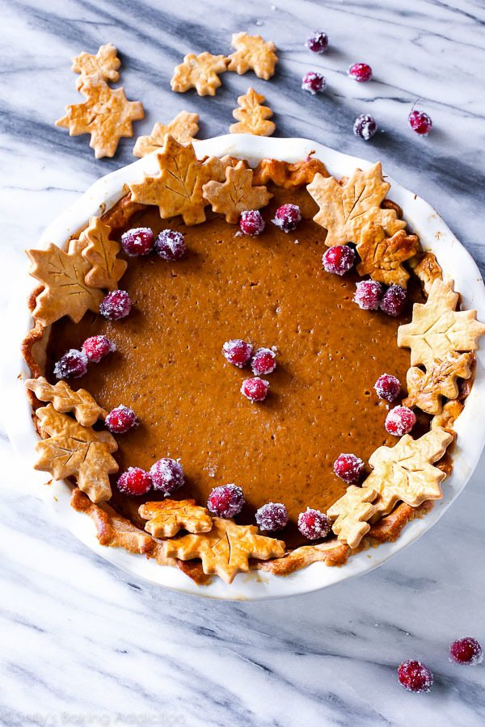

# The Great Pumpkin Pie Recipe

_Source: Combination of [Sally's Baking Addition: The Great Pumpkin Pie Recipe](https://sallysbakingaddiction.com/the-great-pumpkin-pie-recipe/) and [The Perfect Pie](https://smile.amazon.com/Perfect-Pie-Ultimate-Classic-Galettes/dp/1945256915/ref=sr_1_1_)_

<!--  -->

* Prep Time: 45 minutes
* Cook Time: 65 minutes
* Total Time: Overnight (14 hours - includes time for pie dough and cranberries)
* Yield: serves 8-10; 1 cup sugared cranberries

## Description

_Bursting with flavor, this pumpkin pie recipe is my very favorite. It’s rich, smooth, and tastes incredible on my homemade pie crust and served with whipped cream. The pie crust leaves are purely for decor, you can leave those off of the pie and only make 1 pie crust. You can also leave off the sugared cranberries._

## Ingredients

### Sugared Cranberries

* 1 cup (120g) **fresh cranberries**
* 2 cups (400g) **granulated sugar**, divided
* 1 cup (240ml) **water**

### Pumpkin Pie

* 1 recipe [double-crust pie dough](perfect-pie-crust.md) (full recipe makes 2 crusts: 1 for bottom, 1 for leaf decor)
* Egg wash: 1 **large egg** beaten with 1 Tablespoon **whole milk**
* 1 cup (240ml) **heavy cream**
* 1/4 cup (60ml) **whole milk**
* 3 **large eggs** plus 2 **large yolks**
* 1 teaspoon **vanilla extract**
* One 15oz can (about 2 cups; 450g) **pumpkin puree**
* 1 cup drained candied **sweet potatoes or yams**
* 3/4 cup (5 1/4 ounces) **sugar**
* 1/4 cup **maple syrup**
* 1 teaspoon table **salt**
* 2 teaspoons ground or freshly grated **ginger**
* 1/2 teaspoon ground **cinnamon**
* 1/4 teaspoon ground **nutmeg**
* 1/8 teaspoon ground **cloves**
* 1/8 teaspoon fresh ground **black pepper** (seriously!)

<!--
Ingredient list from Sally's Baking Addiction:

1 cup (120g) fresh cranberries*
2 cups (400g) granulated sugar, divided
1 cup (240ml) water
Pumpkin Pie
Homemade pie crust (full recipe makes 2 crusts: 1 for bottom, 1 for leaf decor)
one 15oz can (about 2 cups; 450g) pumpkin puree*
3 large eggs
1 and 1/4 cups (250g) packed light or dark brown sugar
1 Tablespoon (8g) cornstarch
1/2 teaspoon salt
1 and 1/2 teaspoons ground cinnamon
1/2 teaspoon ground ginger*
1/4 teaspoon ground or freshly grated nutmeg*
1/8 teaspoon ground cloves*
1/8 teaspoon fresh ground black pepper
1 cup (240ml) heavy cream
1/4 cup (60ml) milk (I use 1% – any is fine)
egg wash: 1 large egg beaten with 1 Tablespoon milk

-------------------

Ingredient list from The Perfect Pie, page 38:

1 recipe single-crust pie dough (see pages 316-326)
1 cup heavy cream
1 cup whole milk
3 large eggs plus 2 large yolks
1 teaspoon vanilla extract
1 (15-ounce) can unsweetened pumpkin puree
1 cup drained candied sweet potatoes or yams
3/4 cup (5 1/4 ounces) sugar
1/4 cup maple syrup
2 teaspoons grated fresh ginger
1 teaspoon table salt
1/2 teaspoon ground cinnamon
1/4 teaspoon ground nutmeg
-->

## Instructions

### Sugared Cranberries (Optional)

1. Place cranberries in a large bowl; set aside.

2. In a medium saucepan, bring 1 cup of sugar and the water to a boil and whisk until the sugar has dissolved. Remove pan from the heat and allow to cool for 5 minutes.

3. Pour sugar syrup over the cranberries and stir. Let the cranberries sit at room temperature or in the refrigerator for 6 hours or overnight (ideal). You’ll notice the sugar syrup is quite thick after this amount of time.

4. Drain the cranberries from the syrup and pour 1 cup of sugar on top. Toss the cranberries, coating them all the way around.

5. Pour the sugared cranberries on a parchment paper or silicone baking mat-lined baking sheet and let them dry for at least 2 hours at room temperature or in the refrigerator.

6. Cover tightly and store in the refrigerator for up to 3 days.

You’ll have extra, but they’re great for eating or as garnish on other dishes.

### Prepare the Crust

1. Roll half of the 2-crust dough into a 12-inch circle on floured counter. Loosely roll dough around rolling pin and gently unroll it onto 9-inch pie plate, letting excess dough hang over edge. Ease dough into plate by gently lifting edge of dough with your hand while pressing into plate bottom with your other hand.

2. Trim overhang to 1/2 inch beyond lip of plate. Tuck overhang under itself; folded edge should be flush with edge of plate. Crimp dough evenly around edge of plate. 
Crimp the edges with a fork or flute the edges with your fingers, if desired. Wrap dough-lined plate loosely in plastic wrap and refrigerate until firm, about 30 minutes.

###  Pie Crust Leaves (Optional)

If you're using a store bought or have only a single-crust's amount of dough, skip this step.

1. On a floured work surface, roll out one of the balls of chilled dough to about 1/8 inch thickness (the shape doesn’t matter).

2. Using leaf cookie cutters, cut into shapes.

3. Brush each lightly with the beaten egg + milk mixture.

4. Cut leaf veins into leaves using a sharp knife, if desired.

5. Place onto a parchment paper or silicone baking mat-lined baking sheet and bake at 350°F (177°C) for 10 minutes or until lightly browned. Remove and set aside to cool before decorating pie.

### The Pie Proper

1. Adjust oven rack to middle position and heat to 375°F (190°C).

2. Brush edges of chilled pie shell lightly with egg wash mixture. Line with double layer of aluminum foil, covering edges to prevent burning, and fill with pie weights. Bake on foil-lined rimmed baking sheet for 10-15 minutes.

3. Remove foil and weights, rotate sheet, and continue to bake crust until golden brown and crisp, 10 to 15 minutes longer. Transfer sheet to wire rack. (The crust must still be warm when filling is added).

4. While crust is baking, whisk cream, milk, eggs and yolks, and vanilla together in bowl; set aside. Bring pumpkin, sweet potatoes, sugar, maple syrup, ginger, salt, cinnamon, and nutmeg to simmer in large saucepan over medium heat and cook, stirring constantly and mashing sweet potatoes against sides of saucepan, until thick and shiny, 15 to 20 minutes.

5. Remove saucepan from heat and whisk in cream mixture until fully incorporated.

6. Strain mixture through fine-mesh strainer into bowl, using back of ladle or spatula to press solids through strainer.

7. Whisk mixture, then, with pie still on sheet, pour into warm crust. Bake the pie until the center is almost set, about 55-60 minutes. A small part of the center will be wobbly – that’s ok. After 25 minutes of baking, be sure to cover the edges of the crust with aluminum foil or use a pie crust shield to prevent the edges from getting too brown. Check for doneness at minute 50, and then 55, and then 60, etc.

8. Once done, transfer the pie to a wire rack and allow to cool completely for at least 4 hours. Decorate with sugared cranberries and pie crust leaves (see note). You’ll definitely have leftover cranberries – they’re tasty for snacking. Serve pie with whipped cream if desired. Cover leftovers tightly and store in the refrigerator for up to 5 days.

## Notes

1. **Make Ahead & Freezing Instructions:** Pumpkin pie freezes well, up to 3 months. Thaw overnight in the refrigerator before serving. Pie crust dough freezes well for up to 3 months. Thaw overnight in the refrigerator before using. If decorating your pie with sugared cranberries, start them the night before. You’ll also begin the pie crust the night before as well (the dough needs at least 2 hours to chill; overnight is best). The filling can be made the night before as well. In fact, I prefer it that way. It gives the spices, pumpkin, and brown sugar flavors a chance to infuse and blend. It’s awesome. Cover and refrigerate overnight. No need to bring to room temperature before baking.

1. **Cranberries:** Use fresh cranberries, not frozen. The sugar syrup doesn’t coat evenly on the frozen berries, leaving you with rather ugly and some very plain shriveled cranberries.

1. **Pumpkin:** Canned pumpkin is best in this pumpkin pie recipe. If using fresh pumpkin puree, lightly blot it before adding to remove some moisture; the bake time may also be longer.

1. **Spices:** Instead of ground ginger and nutmeg, you can use 2 teaspoons of pumpkin pie spice. Be sure to still add 1/2 teaspoon cinnamon.

1. **Pie Crust:** No matter if you’re using homemade crust or store-bought crust, pre-bake the crust (The Pie Proper; steps 1-3). You can use graham cracker crust if you’d like, but the slices may get a little messy. Pre-bake for 10 minutes just as you do with regular pie crust in this recipe. No need to use pie weights if using a cookie crust.

1. **Mini Pumpkin Pies:** Many have asked about a mini version. Here are my mini pumpkin pies. They’re pretty easy– no blind baking the crust!

