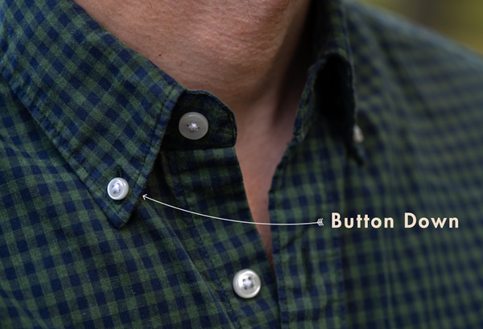

_Source: My friend Jeff Goldschrafe told me ([verified here](https://www.primermagazine.com/2020/learn/button-up-vs-button-down-shirt-difference))_

# "Button up" vs "button down" shirts

There is a difference!

* A ***button up shirt*** buttons up the front of the body all the way. 

* A ***button down shirt***  has buttons on the collar points that you can, well, button down.

