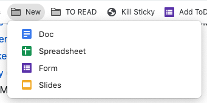

# Easily Create New Google {Docs|Sheets|Forms|Slideshows}

_Source: My friend and manager, Jeff Goldschrafe_

There's a nifty `.new` TLD that lets you easily create new new GSuite artifacts, for easy bookmarking:

* Google Doc: https://doc.new
* Google Sheets: https://sheet.new
* Google Form: https://form.new
* Google Slideshow: https://slide.new

## Neat, huh?

